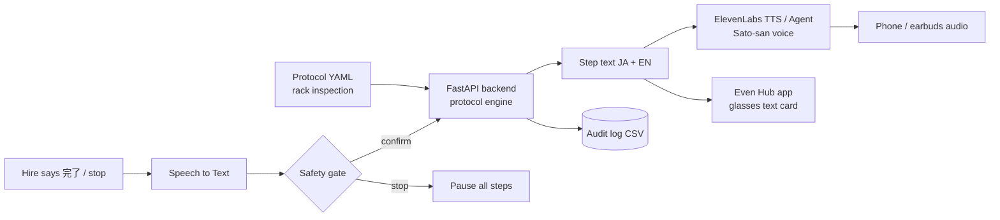
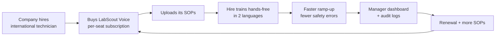

# LabScout Voice + Glasses

> Links to: Main hackathon pick; extends existing LabScout protocol + glasses schema

## Problem
Labs and robotics companies in Japan want international technicians, but SOPs and safety briefings are Japanese-only, so onboarding is slow and risky.

## Who it's for
New international lab/robotics hires; lab managers; HR onboarding teams.

## Solution
A bilingual voice guide (Sato-san) reads each protocol step in Japanese then English, while Even Realities glasses show the short step text. The hire confirms by voice ("完了"), and every step is logged.

## ElevenLabs tools
ElevenAgents (live guide), Voice Design (Sato-san), Text to Speech (pre-made alerts), Sound Effects (step chime).

## Even Realities glasses role
Glasses show the step title and a 1-line instruction; voice plays from phone or earbuds (display-first, no robot control).

Note: Even Realities glasses are display-first (text on the lenses, mic input). Audio plays from the phone or earbuds.

## Chart 1 — Technical workflow pipeline

## Chart 2 — Business flowchart

## 60-minute hackathon scope
Agent + Sato-san voice running the 6-step protocol live; screenshot of glasses card mockup from the dashboard.

## Main risk and mitigation
Voice misrecognising Japanese in a noisy room -> use headset mic, allow tap confirm as backup.

## Next step
- [ ] Discuss, score (impact / effort), decide keep or drop
