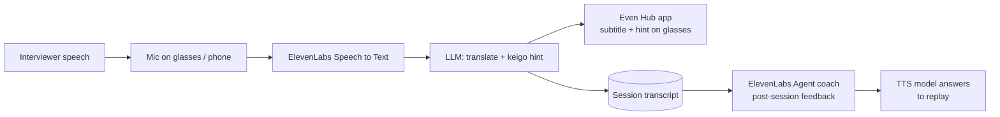
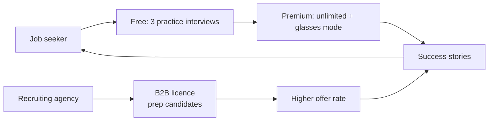

# Keigo Whisper

> Links to: Career theme + glasses; new idea

## Problem
Foreign candidates in Japanese interviews and client meetings freeze on keigo and miss nuance; phone translation apps are rude to use mid-conversation.

## Who it's for
Job seekers, new foreign employees, bilingual recruiters.

## Solution
During a practice interview, Even glasses show live subtitles and a short keigo hint (e.g. say 拝見します). Afterwards an ElevenLabs voice coach replays the best phrasing and gives feedback.

## ElevenLabs tools
ElevenAgents (practice interviewer), Speech to Text (live subtitles), Text to Speech (model answers), Voice Design (interviewer).

## Even Realities glasses role
Glasses = subtitles + 1-line hint; the core value is heads-up, eyes-on-the-person support.

Note: Even Realities glasses are display-first (text on the lenses, mic input). Audio plays from the phone or earbuds.

## Chart 1 — Technical workflow pipeline

## Chart 2 — Business flowchart

## 60-minute hackathon scope
Phone-only demo: practice interviewer agent + post-session feedback; glasses shown as a mock text card.

## Main risk and mitigation
Live coaching in real interviews may be seen as cheating -> position as practice and onboarding, not live exam help.

## Next step
- [ ] Discuss, score (impact / effort), decide keep or drop
