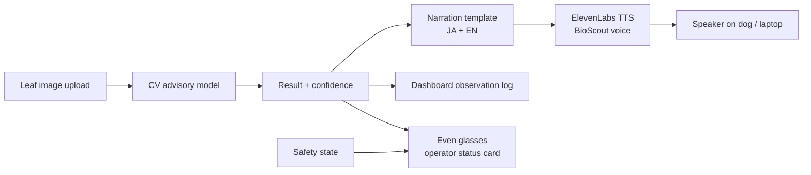
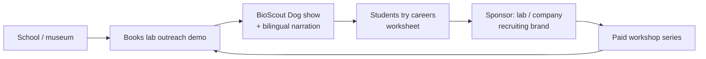

# BioScout Dog Narrator

> Links to: Extends existing BioScout Dog plant-health demo

## Problem
Science demos and school visits to labs are hard to follow; students don't see robotics/lab careers as reachable.

## Who it's for
School visitors, science fair audiences, lab outreach teams.

## Solution
The robot dog gets a friendly voice: after a leaf image is classified (advisory CV), it explains the result, the uncertainty, and 'what a plant scientist would do next' in JA/EN. Glasses show the operator the sample ID and safety state.

## ElevenLabs tools
Voice Design (dog character), Text to Speech, Sound Effects (friendly beeps), Music (demo intro).

## Even Realities glasses role
Operator glasses show sample ID, confidence, e-stop state; the audience hears the dog.

Note: Even Realities glasses are display-first (text on the lenses, mic input). Audio plays from the phone or earbuds.

## Chart 1 — Technical workflow pipeline

## Chart 2 — Business flowchart

## 60-minute hackathon scope
TTS narration for 3 example results + short intro music; no real robot movement.

## Main risk and mitigation
Over-confident plant diagnosis -> narration always says 'advisory result'.

## Next step
- [ ] Discuss, score (impact / effort), decide keep or drop
