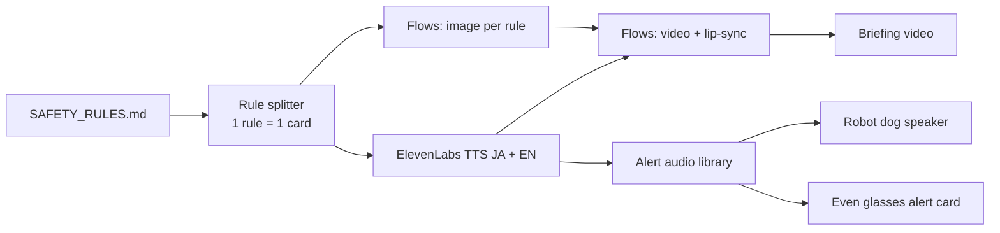
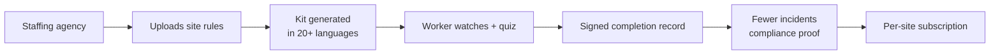

# Bilingual Safety Briefing Kit

> Links to: Reuses SAFETY_RULES.md and robot e-stop alerts

## Problem
Factory and lab safety orientation in Japan is often Japanese-only; foreign workers sign sheets they don't fully understand.

## Who it's for
Factories, labs, staffing agencies placing foreign workers.

## Solution
Turn a safety rule list into a short bilingual audio + video briefing, a quiz, and a library of standard voice alerts (emergency stop, battery low, obstacle) reusable on robots and glasses.

## ElevenLabs tools
Text to Speech, Dubbing, Sound Effects, Flows (image + voice + video), Voice Design.

## Even Realities glasses role
Glasses flash the alert text while the same voice alert plays - consistent 'alert language' across robot, glasses and site.

Note: Even Realities glasses are display-first (text on the lenses, mic input). Audio plays from the phone or earbuds.

## Chart 1 — Technical workflow pipeline

## Chart 2 — Business flowchart

## 60-minute hackathon scope
3 rules -> 30-second bilingual video in Flows + 3 alert sounds.

## Main risk and mitigation
Legal accuracy of translated safety text -> human review step before publishing.

## Next step
- [ ] Discuss, score (impact / effort), decide keep or drop
