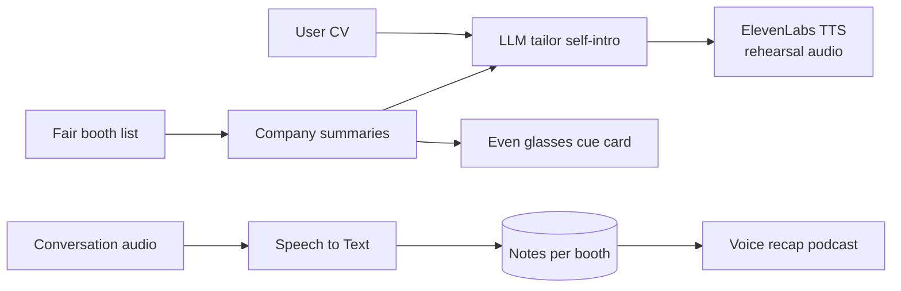
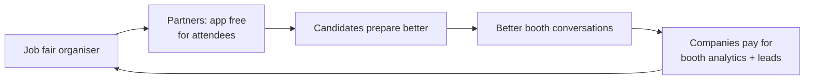

# Job Fair Glasses Companion

> Links to: New idea; glasses + career theme

## Problem
At Japanese job fairs (合同説明会) candidates meet 20+ booths, forget names and details, and fumble self-introductions.

## Who it's for
Students in shūkatsu, mid-career foreign job seekers.

## Solution
Glasses show the next booth's company summary and the recruiter's name; before each booth an ElevenLabs voice coach gives a 20-second self-intro tailored to that company. After the fair, a voice recap of every conversation.

## ElevenLabs tools
ElevenAgents (coach), Text to Speech (tailored intros), Speech to Text (conversation notes).

## Even Realities glasses role
Glasses = quiet heads-up cue cards; phone handles audio and notes.

Note: Even Realities glasses are display-first (text on the lenses, mic input). Audio plays from the phone or earbuds.

## Chart 1 — Technical workflow pipeline

## Chart 2 — Business flowchart

## 60-minute hackathon scope
Voice coach agent that takes a company name and gives a tailored 20-second self-intro.

## Main risk and mitigation
Recording conversations needs consent -> notes only from the user's own voice memo.

## Next step
- [ ] Discuss, score (impact / effort), decide keep or drop
