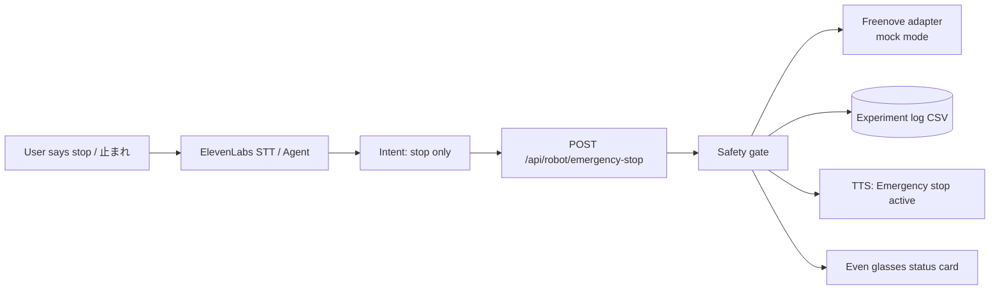
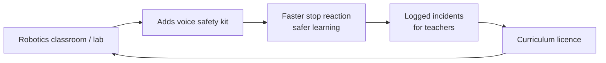

# Robot Dog Voice Safety Layer

> Links to: Extends Freenove dashboard + FastAPI backend

## Problem
Beginners controlling robots panic and can't reach the e-stop button; lab robots need hands-free safe stop.

## Who it's for
Robotics learners, lab automation teams, educators.

## Solution
A voice layer on top of the existing FastAPI safety gate: saying 'stop' or '止まれ' triggers the emergency stop endpoint instantly; the robot confirms status aloud and on glasses. Movement by voice stays disabled (display + stop only).

## ElevenLabs tools
ElevenAgents or Speech to Text (stop word), Text to Speech (status replies), Voice Design (robot voice).

## Even Realities glasses role
Glasses show e-stop state, battery, obstacle warning; they never send movement commands.

Note: Even Realities glasses are display-first (text on the lenses, mic input). Audio plays from the phone or earbuds.

## Chart 1 — Technical workflow pipeline

## Chart 2 — Business flowchart

## 60-minute hackathon scope
Mock mode only: agent recognises stop words and calls a mock e-stop; dashboard shows the state change.

## Main risk and mitigation
Voice latency too slow for real safety -> physical e-stop stays primary; voice is an extra layer.

## Next step
- [ ] Discuss, score (impact / effort), decide keep or drop
